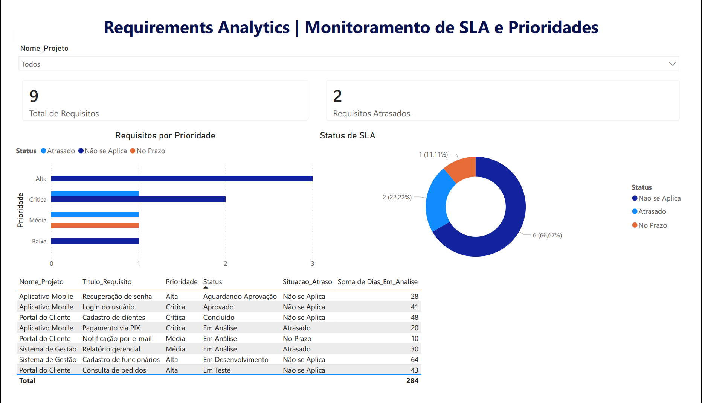

# Requirements Analytics 📊

Bem-vindo ao meu projeto de portefólio que une Engenharia de Requisitos e Business Intelligence (Data Analytics).

Este projeto nasceu de um problema muito comum no dia a dia da gestão de projetos: **como garantir que os prazos (SLAs) de análise de requisitos estão a ser cumpridos sem depender de folhas de cálculo manuais?**

Desenvolvi uma solução completa (de ponta a ponta) para dar aos Project Managers (PMs) visibilidade total sobre os gargalos do projeto, misturando conceitos de qualidade (IREB CPRE) com modelagem de dados real.

## 🎯 O Problema
No fluxo de desenvolvimento de software, estabelecemos um SLA de 15 dias para analisar e aprovar requisitos. Sem uma base centralizada, é difícil identificar rapidamente quais os requisitos críticos que estão parados. O PM precisava de uma visão clara e imediata do que priorizar no dia a dia para evitar o atraso das equipas de desenvolvimento.

## 🛠️ A Solução Técnica e Arquitetura
Para resolver isto, optei por uma arquitetura focada em performance, fazendo o trabalho pesado no back-end em vez de sobrecarregar a ferramenta de visualização:

*   **SQL Server (Back-end):** Modelei as tabelas relacionais (PKs e FKs) e criei `VIEWS` para encapsular as regras de negócio. Toda a lógica de cálculo de atraso em tempo real (usando `CASE` e `DATEDIFF`) é processada no servidor de banco de dados.
*   **Power BI (Front-end):** Com os dados já tratados pela View, o Power BI consome a informação em *Import Mode*. O resultado é um dashboard extremamente rápido e focado apenas na interação visual (garantindo o Requisito Não Funcional de performance).

## 📂 Estrutura do Repositório
Aqui encontra todo o código SQL utilizado para construir a base e as regras de negócio:

*   `01_create_database.sql` - Criação da base de dados principal.
*   `02_create_tables.sql` - Modelagem física e restrições.
*   `03_insert_data.sql` - Carga de dados simulando cenários reais de projeto.
*   `04_views.sql` - **O coração da regra de negócio.** View que calcula dinamicamente o status do SLA.
*   `05_queries.sql` - Consultas de validação analítica.

## 📈 Resultados

O painel foi desenhado com foco em usabilidade (UX) e leitura executiva (gestão por exceção):
1.  **KPIs Diretos:** O gestor sabe numa fração de segundo o total de pendências e o que está atrasado.
2.  **Status do SLA (Gráfico de Rosca):** Visão macro da saúde dos prazos.
3.  **Prioridade vs. Atraso (Gráfico de Barras):** A matriz de decisão. Mostra os itens atrasados cruzados com o nível de criticidade, indicando onde a equipa deve focar primeiro.
4.  **Tabela de Detalhes:** A visão granular (linha a linha) para o PM saber exatamente qual requisito cobrar e a quem.

---
*Desenvolvido por Emerson Gomes* | [LinkedIn](linkedin.com/in/emerson-vieira-gomes-51a10a200)
